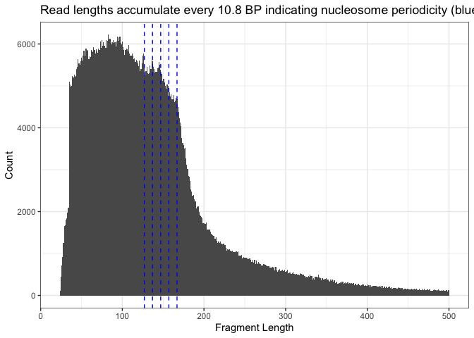

mcf7_mtx_file
================
2022-06-04

## Overview

reference:
<https://support.10xgenomics.com/single-cell-atac/software/pipelines/latest/output/matrices>

fragment file of cfDNA is mcf7_noTx_uniq_comb_pe.sorted.bed need to
remove last 2 columns and add a random cell barcode

to replace the h5 input file, we can instead use seurat::Read10X() and
use MEX format we need to generate the following files: ├── barcodes.tsv
├── peaks.bed └── matrix.mtx

barcodes.tsv: this is a single column file with random cell id’s in it,
lets use 4000 repeating random strings

peaks.bed: mcf7_noTx_uniq_comb_pe.sorted.bed, but use only the first 3
columns

matrix.mtx: %%MatrixMarket matrix coordinate integer general
%metadata_json: {“format_version”: 2, “software_version”: “8000.20.5”}
67487 4200 19929988 67437 1 2 67412 1 2 67382 1 4 67370 1 1 67366 1 2
67361 1 4 67348 1 2

row 1 meta row 2 meta row 3: 1: peaks.bed length 2: barcodes.tsv length
3: total number of rows in mtx NOW DATA col 1: index into peaks.bed col
2: index into barcodes.tsv col 3: counts of feature

## make the fragment file

``` r
# load peak calls

frag_out_file = paste0(proj_dir, "/data/data_alexis/mcf7_noTx_uniq_comb_pe_fragments.tsv")
frag_out_gzfile = paste0(proj_dir, "/data/data_alexis/mcf7_noTx_uniq_comb_pe_fragments.tsv.gz")

cfdna_peak_file = paste0(proj_dir, "/data/data_alexis/mcf7_noTx_uniq_comb_pe.sorted.bed")

# subsample for speed
cfdna_peak_df = data.frame(fread(cfdna_peak_file, header=F))
cfdna_peak_df$diff = cfdna_peak_df$V3-cfdna_peak_df$V2

# make a quick plot
subsample_idx = sort(sample(1:nrow(cfdna_peak_df), 1000000))
gg = ggplot(cfdna_peak_df[subsample_idx,], aes(x=diff)) + 
        geom_histogram(binwidth=1) +
        geom_vline(aes(xintercept=167),
            color="blue", linetype="dashed", size=0.5) +
        geom_vline(aes(xintercept=157),
            color="blue", linetype="dashed", size=0.5) +
        geom_vline(aes(xintercept=147),
            color="blue", linetype="dashed", size=0.5) +
        geom_vline(aes(xintercept=137),
            color="blue", linetype="dashed", size=0.5) +
        geom_vline(aes(xintercept=127),
            color="blue", linetype="dashed", size=0.5) +
        theme_bw() + labs(x ="Fragment Length", y = "Count") 
gg
```



``` r
# match the correct read length
read_len_idx = which(cfdna_peak_df$diff < 180 & cfdna_peak_df$diff > 120)
chr_idx = which(cfdna_peak_df$V1 %in% c("chr11", "chr19"))
subsample_idx = intersect(read_len_idx, chr_idx)

cfdna_peak_df = cfdna_peak_df[subsample_idx, ]
knitr::kable(head(cfdna_peak_df), "simple", caption="Table: cfdna_peak_df")
```

|          | V1    |    V2 |    V3 |  V4 | V5  | V6  | diff |
|----------|:------|------:|------:|----:|:----|:----|-----:|
| 12902518 | chr11 | 60260 | 60415 | 155 | .   | \+  |  155 |
| 12902524 | chr11 | 60860 | 61032 | 172 | .   | \+  |  172 |
| 12902533 | chr11 | 61108 | 61278 | 170 | .   | \+  |  170 |
| 12902536 | chr11 | 61176 | 61350 | 174 | .   | \+  |  174 |
| 12902541 | chr11 | 61460 | 61602 | 142 | .   | \+  |  142 |
| 12902549 | chr11 | 62136 | 62279 | 143 | .   | \+  |  143 |

Table: cfdna_peak_df

``` r
# now remove last 2 columns 
fragment_df = cfdna_peak_df[,1:4]

# make random barcode for 4000 cells
barcode_ref = stri_rand_strings(4000, 16, pattern = "[ACGT]")

# assign barcode for each fragment
# we repeats them to make indexing easier
barcode_vec = rep(barcode_ref, ceiling(nrow(fragment_df)/4000))
barcode_vec = barcode_vec[1:nrow(fragment_df)]
fragment_df = cbind(fragment_df, barcode_vec)

# columns need to be
# chr start end barcode count
fragment_df = fragment_df[,c(1,2,3,5,4)]
write.table(fragment_df, frag_out_file, col.names=F, quote=F, sep="\t", row.names = F)
# gzip file
bgzip(frag_out_file, frag_out_gzfile, overwrite = T)
```

    ## [1] "/Users/davidnat/Documents/projects/greenelab/cfDNA_atac_demo/data/data_alexis/mcf7_noTx_uniq_comb_pe_fragments.tsv.gz"

``` r
# make index
indexTabix(frag_out_gzfile, format="bed")
```

    ## [1] "/Users/davidnat/Documents/projects/greenelab/cfDNA_atac_demo/data/data_alexis/mcf7_noTx_uniq_comb_pe_fragments.tsv.gz.tbi"

## make the barcode file

``` r
barcode_out_file = paste0(proj_dir, "/data/data_alexis/mcf7_noTx_uniq_comb_pe/barcodes.tsv")

barcode_ref_df = data.frame(barcode_ref)

knitr::kable(head(barcode_ref_df), "simple", caption="Table: barcode_ref")
```

| barcode_ref      |
|:-----------------|
| CCAAGGCCTCTGCTTC |
| GCCCGTATGCTCTCAC |
| CGTATTCTTTCGCCAC |
| GCGTGGCCATCTCGTG |
| GGCTCTGCATCTGAAG |
| TTACTATAATAATGAA |

Table: barcode_ref

``` r
write.table(barcode_ref_df, barcode_out_file, col.names=F, quote=F, sep="\t", row.names = F)
```

## make the peaks.bed file

``` r
peaks_out_file = paste0(proj_dir, "/data/data_alexis/mcf7_noTx_uniq_comb_pe/features.tsv")
peaks_out_gzfile = paste0(proj_dir, "/data/data_alexis/mcf7_noTx_uniq_comb_pe/features.tsv.gz")

peaks_df = data.table(cfdna_peak_df[,1:3])

# write out the file
con <- file(peaks_out_file,'wt')


old <- Sys.time()

max_idx = ceiling(nrow(peaks_df) / 10000000)
for( idx in 1:max_idx){
    start_idx = (idx-1)*10000000 +1
    end_idx = (idx)*10000000
    end_idx = min(end_idx, nrow(peaks_df))
    curr_df = peaks_df[start_idx:end_idx,]
    
    feature_vec1 = paste(curr_df$V1, ":", curr_df$V2, "-", curr_df$V3, sep="")
    
    write.table(data.frame(feature=feature_vec1, feature_name=start_idx:end_idx),
                  con,
                  append = TRUE,
                  sep = '\t',
                  row.names = FALSE,
                  col.names = FALSE,
                  quote=FALSE)
    
    feature_vec1 = c()
    gc()
    
    print(idx)
    new <- Sys.time() - old
    print(new)

}
```

    ## [1] 1
    ## Time difference of 7.025873 secs

``` r
close(con)

curr_df = NA
peaks_df = NA

bgzip(peaks_out_file, peaks_out_gzfile, overwrite = T)
```

    ## [1] "/Users/davidnat/Documents/projects/greenelab/cfDNA_atac_demo/data/data_alexis/mcf7_noTx_uniq_comb_pe/features.tsv.gz"

## Make the matrix.mtx file

### set-up mtx

``` r
mtx_out_file = paste0(proj_dir, "/data/data_alexis/mcf7_noTx_uniq_comb_pe/matrix.mtx")
mtx_out_gzfile = paste0(proj_dir, "/data/data_alexis/mcf7_noTx_uniq_comb_pe/matrix.mtx.gz")


first_line = "%%MatrixMarket matrix coordinate integer general"
second_line = "%metadata_json: {\"format_version\": 2, \"software_version\": \"8000.20.5\"}"

num_peaks = nrow(fragment_df) # this is by design, we assign a peak to only one cell; row 3 col 1
num_barcodes = length(barcode_ref) # row 3 col 2
num_entries = nrow(fragment_df) # row 3 col 3

# now make the indicies for each data type
col1 = 1:num_peaks
col2 = rep(1:4000, ceiling(nrow(fragment_df)/4000))
col2 = col2[1:nrow(fragment_df)]
col3 = fragment_df[,5]

mtx_df = data.frame(peaks=c(num_peaks, col1),
                    barcodes=c(num_barcodes, col2),
                    counts=c(num_entries, col3))

# write out the file
con <- file(mtx_out_file,'wt')

cat(paste0(first_line,'\n'), file = con)
cat(paste0(second_line,'\n'), file = con)

write.table(mtx_df,
              con,
              append = TRUE,
              sep = '\t',
              row.names = FALSE,
              col.names = FALSE)
close(con)
bgzip(mtx_out_file, mtx_out_gzfile, overwrite = T)
```

    ## [1] "/Users/davidnat/Documents/projects/greenelab/cfDNA_atac_demo/data/data_alexis/mcf7_noTx_uniq_comb_pe/matrix.mtx.gz"
