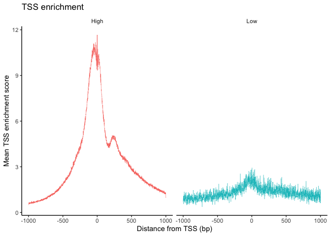
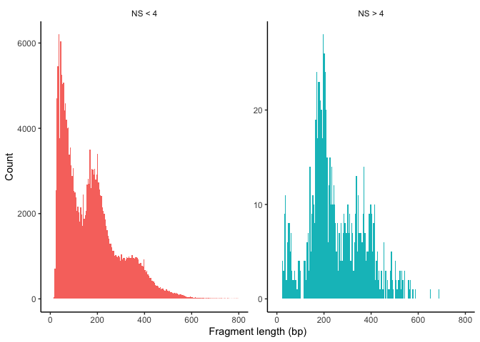
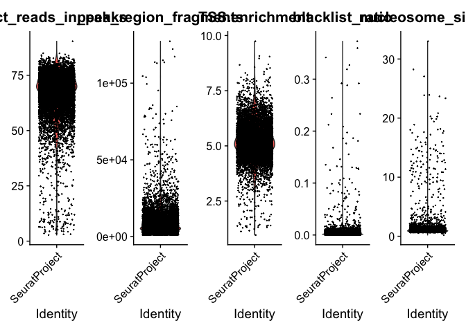
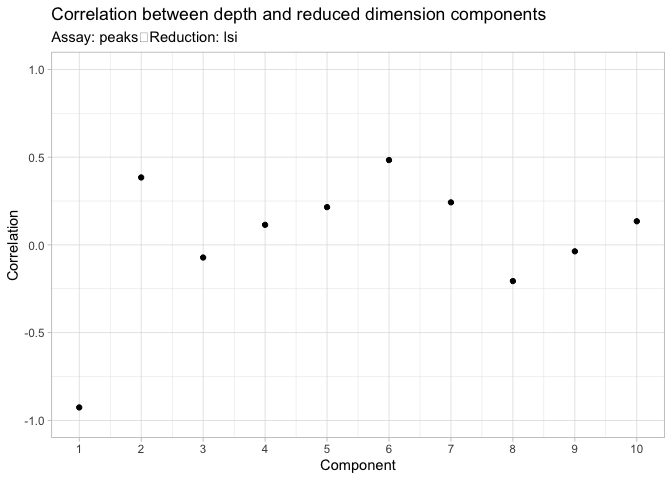
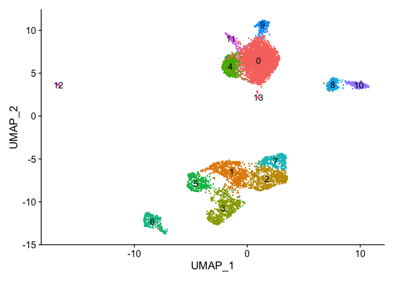
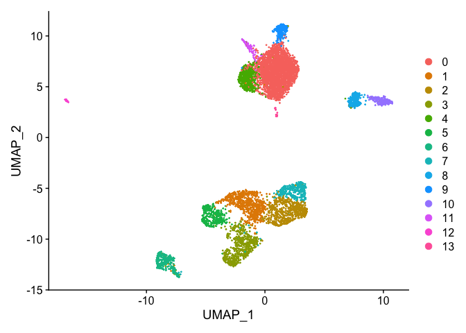
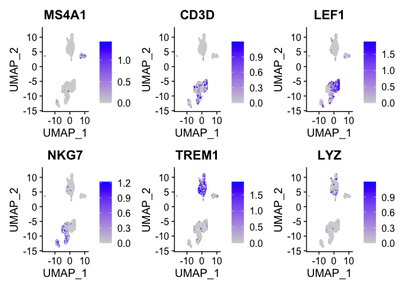
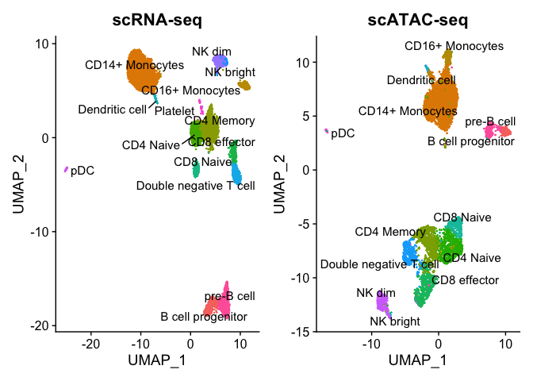
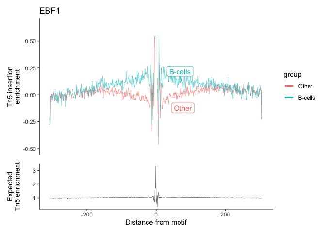
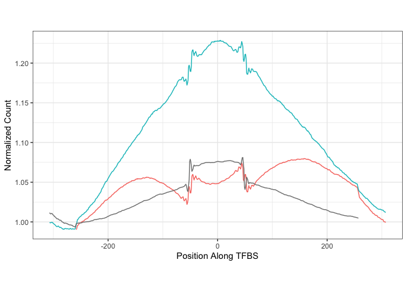

scATAC_seq_demo
================
Natalie Davidson
5/17/2021

## Overview

This file is a demo of scATAC-seq analysis found here:
<https://satijalab.org/signac/articles/pbmc_vignette.html>

This is the basis for the pseudobulk scATAC-Seq analysis.

Taken directly from the vignette:

-   Peak/Cell matrix. This is analogous to the gene expression count
    matrix used to analyze single-cell RNA-seq. However, instead of
    genes, each row of the matrix represents a region of the genome (a
    peak), that is predicted to represent a region of open chromatin.
    Each value in the matrix represents the number of Tn5 integration
    sites for each single barcode (i.e. a cell) that map within each
    peak. You can find more detail on the 10X Website.

-   Fragment file. This represents a full list of all unique fragments
    across all single cells. It is a substantially larger file, is
    slower to work with, and is stored on-disk (instead of in memory).
    However, the advantage of retaining this file is that it contains
    all fragments associated with each single cell, as opposed to only
    fragments that map to peaks. More information about the fragment
    file can be found on the 10x Genomics website or on the sinto
    website.

``` r
# load peak count matrix and meta data

peak_file = paste0(proj_dir, "/data/atac_v1_pbmc_10k_filtered_peak_bc_matrix.h5")
peak_meta_file = paste0(proj_dir, "/data/atac_v1_pbmc_10k_singlecell.csv")
counts <- Read10X_h5(filename = peak_file)
metadata <- read.csv(
  file = peak_meta_file,
  header = TRUE,
  row.names = 1
)

# load fragment file
frag_file = paste0(proj_dir, "/data/atac_v1_pbmc_10k_fragments.tsv.gz")
chrom_assay <- CreateChromatinAssay(
  counts = counts,
  sep = c(":", "-"),
  genome = 'hg19',
  fragments = frag_file,
  min.cells = 10,
  min.features = 200
)

# make the seurat object
pbmc <- CreateSeuratObject(
  counts = chrom_assay,
  assay = "peaks",
  meta.data = metadata
)
chrom_assay  = NA
pbmc
```

    ## An object of class Seurat 
    ## 87561 features across 8728 samples within 1 assay 
    ## Active assay: peaks (87561 features, 0 variable features)

## Inspect the objects

``` r
# whats in the ChromatinAssay?
pbmc[['peaks']]
```

    ## ChromatinAssay data with 87561 features for 8728 cells
    ## Variable features: 0 
    ## Genome: hg19 
    ## Annotation present: FALSE 
    ## Motifs present: FALSE 
    ## Fragment files: 1

``` r
# we can call granges on ChromatinAssay to see all the peaks
granges(pbmc)
```

    ## GRanges object with 87561 ranges and 0 metadata columns:
    ##           seqnames            ranges strand
    ##              <Rle>         <IRanges>  <Rle>
    ##       [1]     chr1     565107-565550      *
    ##       [2]     chr1     569174-569639      *
    ##       [3]     chr1     713460-714823      *
    ##       [4]     chr1     752422-753038      *
    ##       [5]     chr1     762106-763359      *
    ##       ...      ...               ...    ...
    ##   [87557]     chrY 58993392-58993760      *
    ##   [87558]     chrY 58994571-58994823      *
    ##   [87559]     chrY 58996352-58997331      *
    ##   [87560]     chrY 59001782-59002175      *
    ##   [87561]     chrY 59017143-59017246      *
    ##   -------
    ##   seqinfo: 24 sequences from an unspecified genome; no seqlengths

## Add gene annotations

``` r
# extract gene annotations from EnsDb
annotations <- GetGRangesFromEnsDb(ensdb = EnsDb.Hsapiens.v75) # v86

# change to UCSC style since the data was mapped to hg19
seqlevelsStyle(annotations) <- 'UCSC'

# add the gene information to the object
Annotation(pbmc) <- annotations
```

## Do QC

Taken from the vignette:

We can now compute some QC metrics for the scATAC-seq experiment. We
currently suggest the following metrics below to assess data quality. As
with scRNA-seq, the expected range of values for these parameters will
vary depending on your biological system, cell viability, and other
factors.

-   Nucleosome banding pattern: The histogram of DNA fragment sizes
    (determined from the paired-end sequencing reads) should exhibit a
    strong nucleosome banding pattern corresponding to the length of DNA
    wrapped around a single nucleosome. We calculate this per single
    cell, and quantify the approximate ratio of mononucleosomal to
    nucleosome-free fragments (stored as nucleosome_signal)

-   Transcriptional start site (TSS) enrichment score. The ENCODE
    project has defined an ATAC-seq targeting score based on the ratio
    of fragments centered at the TSS to fragments in TSS-flanking
    regions (see <https://www.encodeproject.org/data-standards/terms/>).
    Poor ATAC-seq experiments typically will have a low TSS enrichment
    score. We can compute this metric for each cell with the
    TSSEnrichment() function, and the results are stored in metadata
    under the column name TSS.enrichment.

-   Total number of fragments in peaks: A measure of cellular sequencing
    depth / complexity. Cells with very few reads may need to be
    excluded due to low sequencing depth. Cells with extremely high
    levels may represent doublets, nuclei clumps, or other artefacts.

-   Fraction of fragments in peaks: Represents the fraction of all
    fragments that fall within ATAC-seq peaks. Cells with low values
    (i.e. \<15-20%) often represent low-quality cells or technical
    artifacts that should be removed. Note that this value can be
    sensitive to the set of peaks used.

-   Ratio reads in genomic blacklist regions The ENCODE project has
    provided a list of blacklist regions, representing reads which are
    often associated with artefactual signal. Cells with a high
    proportion of reads mapping to these areas (compared to reads
    mapping to peaks) often represent technical artifacts and should be
    removed. ENCODE blacklist regions for human (hg19 and GRCh38), mouse
    (mm10), Drosophila (dm3), and C. elegans (ce10) are included in the
    Signac package.

**Note:** the last three metrics can be obtained from the output of
CellRanger (which is stored in the object metadata), but can also be
calculated for non-10x datasets using Signac (more information at the
end of this document).

``` r
# compute nucleosome signal score per cell
pbmc <- NucleosomeSignal(object = pbmc)

# compute TSS enrichment score per cell
pbmc <- TSSEnrichment(object = pbmc, fast = FALSE)

# add blacklist ratio and fraction of reads in peaks
pbmc$pct_reads_in_peaks <- pbmc$peak_region_fragments / pbmc$passed_filters * 100
pbmc$blacklist_ratio <- pbmc$blacklist_region_fragments / pbmc$peak_region_fragments
```

Plot the QC patterns

``` r
# plot the TSS enrichment
pbmc$high.tss <- ifelse(pbmc$TSS.enrichment > 2, 'High', 'Low')
TSSPlot(pbmc, group.by = 'high.tss') + NoLegend()
```



``` r
# plot the fragment periodicity
# also group the nucleosomal banding pattern
pbmc$nucleosome_group <- ifelse(pbmc$nucleosome_signal > 4, 'NS > 4', 'NS < 4')
FragmentHistogram(object = pbmc, group.by = 'nucleosome_group')
```



``` r
VlnPlot(
  object = pbmc,
  features = c('pct_reads_in_peaks', 'peak_region_fragments',
               'TSS.enrichment', 'blacklist_ratio', 'nucleosome_signal'),
  pt.size = 0.1,
  ncol = 5
)
```



Remove cells that don’t pass QC

``` r
pbmc <- subset(
  x = pbmc,
  subset = peak_region_fragments > 3000 &
    peak_region_fragments < 20000 &
    pct_reads_in_peaks > 15 &
    blacklist_ratio < 0.05 &
    nucleosome_signal < 4 &
    TSS.enrichment > 2
)
pbmc
```

    ## An object of class Seurat 
    ## 87561 features across 7060 samples within 1 assay 
    ## Active assay: peaks (87561 features, 0 variable features)

## Normalization and dim-redux

-   **Normalization:** Signac performs term frequency-inverse document
    frequency (TF-IDF) normalization. This is a two-step normalization
    procedure, that both normalizes across cells to correct for
    differences in cellular sequencing depth, and across peaks to give
    higher values to more rare peaks.

-   **Feature selection:** The low dynamic range of scATAC-seq data
    makes it challenging to perform variable feature selection, as we do
    for scRNA-seq. Instead, we can choose to use only the top n% of
    features (peaks) for dimensional reduction, or remove features
    present in less than n cells with the FindTopFeatures() function.
    Here, we will all features, though we note that we see very similar
    results when using only a subset of features (try setting min.cutoff
    to ‘q75’ to use the top 25% all peaks), with faster runtimes.
    Features used for dimensional reduction are automatically set as
    VariableFeatures() for the Seurat object by this function.

-   **Dimension reduction:** We next run singular value decomposition
    (SVD) on the TD-IDF matrix, using the features (peaks) selected
    above. This returns a reduced dimension representation of the object
    (for users who are more familiar with scRNA-seq, you can think of
    this as analogous to the output of PCA).

``` r
pbmc <- RunTFIDF(pbmc)
pbmc <- FindTopFeatures(pbmc, min.cutoff = 'q25')
pbmc <- RunSVD(pbmc)

# plot the LSI components correlation with depth
# typically depth is correlated with the first LSI comp.

DepthCor(pbmc)
```


\## Make UMAP

``` r
pbmc <- RunUMAP(object = pbmc, reduction = 'lsi', dims = 2:30)
pbmc <- FindNeighbors(object = pbmc, reduction = 'lsi', dims = 2:30)
pbmc <- FindClusters(object = pbmc, verbose = FALSE, algorithm = 3)
DimPlot(object = pbmc, label = TRUE) + NoLegend()
```



## Create a gene activity matrix

``` r
# get the activities of the genes from the peaks
gene.activities <- GeneActivity(pbmc)

# add the gene activity matrix to the Seurat object as a new assay and normalize it
pbmc[['RNA']] <- CreateAssayObject(counts = gene.activities)
pbmc <- NormalizeData(
  object = pbmc,
  assay = 'RNA',
  normalization.method = 'LogNormalize',
  scale.factor = median(pbmc$nCount_RNA)
)

DefaultAssay(pbmc) <- 'RNA'

DimPlot(object = pbmc, reduction = "umap")
```



``` r
FeaturePlot(
  object = pbmc,
  features = c('MS4A1', 'CD3D', 'LEF1', 'NKG7', 'TREM1', 'LYZ'),
  pt.size = 0.1,
  max.cutoff = 'q95',
  ncol = 3
)
```



## now get labels from scRNASeq

``` r
# Load the pre-processed scRNA-seq data for PBMCs
expr_file = paste0(proj_dir, "/data/pbmc_10k_v3.rds")

pbmc_rna <- readRDS(expr_file)

transfer.anchors <- FindTransferAnchors(
  reference = pbmc_rna,
  query = pbmc,
  reduction = 'cca'
)

predicted.labels <- TransferData(
  anchorset = transfer.anchors,
  refdata = pbmc_rna$celltype,
  weight.reduction = pbmc[['lsi']],
  dims = 2:30
)

pbmc <- AddMetaData(object = pbmc, metadata = predicted.labels)
```

``` r
plot1 <- DimPlot(
  object = pbmc_rna,
  group.by = 'celltype',
  label = TRUE,
  repel = TRUE) + NoLegend() + ggtitle('scRNA-seq')

plot2 <- DimPlot(
  object = pbmc,
  group.by = 'predicted.id',
  label = TRUE,
  repel = TRUE) + NoLegend() + ggtitle('scATAC-seq')

plot1 + plot2
```



now match clusters from RNA-Seq to ATAC-Seq

``` r
#pbmc <- subset(pbmc, idents = 14, invert = TRUE)
pbmc <- RenameIdents(
  object = pbmc,
  '0' = 'CD14 Mono',
  '1' = 'CD4 Memory',
  '2' = 'CD8 Effector',
  '3' = 'CD4 Naive',
  '4' = 'CD14 Mono',
  '5' = 'DN T',
  '6' = 'CD8 Naive',
  '7' = 'NK CD56Dim',
  '8' = 'pre-B',
  '9' = 'CD16 Mono',
  '10' = 'pro-B',
  '11' = 'DC',
  '12' = 'NK CD56bright',
  '13' = 'pDC'
)
pbmc <- RenameIdents(
  object = pbmc,
  'CD14 Mono' = 'Mono',
  'CD4 Memory' = 'T-cells',
  'CD8 Effector' = 'T-cells',
  'CD4 Naive' = 'T-cells',
  'CD14 Mono' = 'Mono',
  'DN T' = 'T-cells',
  'CD8 Naive' = 'T-cells',
  'NK CD56Dim' = 'NK',
  'pre-B' = 'B-cells',
  'CD16 Mono' = 'Mono',
  'pro-B' = 'pro-B',
  'DC' = 'DC',
  'NK CD56bright' = 'NK',
  'pDC' = 'DC'
)
pbmc <- RenameIdents(
  object = pbmc,
  'Mono' = 'Other',
  'T-cells' = 'Other',
  'T-cells' = 'Other',
  'T-cells' = 'Other',
  'Mono' = 'Other',
  'T-cells' = 'Other',
  'T-cells' = 'Other',
  'NK' = 'Other',
  'B-cells' = 'B-cells',
  'Mono' = 'Other',
  'pro-B' = 'B-cells',
  'DC' = 'Other',
  'NK' = 'Other',
  'DC' = 'Other'
)
```

# Get the TFBS motifs and footprints

We will compare these with the footprints gathers from cfDNA

``` r
pbmc_rna =NA
gene.activities = NA
counts = NA

DefaultAssay(pbmc) <- 'peaks'

pwm <- getMatrixSet(
  x = JASPAR2020,
  opts = list(species = 9606, all_versions = FALSE)
)

all_motifs = lapply(pwm, function(x) name(x))
motif_idx = grep("EBF1", unlist(all_motifs))
pwm_select = pwm[motif_idx]
    
pbmc <- AddMotifs(pbmc, genome = BSgenome.Hsapiens.UCSC.hg19, pfm = pwm_select)
```

### Plot footprints

``` r
# gather the footprinting information for sets of motifs

# gather the footprinting information for sets of motifs
pbmc2 <- Footprint(
  object = subset(x = pbmc, idents = c("B-cells", "Other")),
  motif.name = c("EBF1"),
  genome = BSgenome.Hsapiens.UCSC.hg19,upstream = 300, downstream = 300,in.peaks = F
)
footprint_df = GetFootprintData(pbmc2, features = c("EBF1"))

# plot the footprint data for each group of cells
p2 <- PlotFootprint(pbmc2, features = c("EBF1"))
p2
```



``` r
pdf("data/data_alexis/atac_plot.pdf", height=2, width=4)
print(p2)
dev.off()
```

    ## quartz_off_screen 
    ##                 2

### plot smoothed footprints

``` r
# gather the footprinting information for sets of motifs

library(ggplot2)
theme_set(theme_bw())
library(signal)
library(zoo)

gg_footprint = ggplot(footprint_df, aes(x=position, y=norm.value, color=group)) + 
                #geom_line() +
                geom_line(aes(y=rollmean(norm.value, 100, na.pad=TRUE))) +
                theme_bw() + theme(legend.position = "none", aspect.ratio = 9/16) +
                labs(x ="Position Along TFBS", y = "Normalized Count")
gg_footprint
```



``` r
pdf("data/data_alexis/atac_plot.pdf", height=2, width=4)
print(gg_footprint)
dev.off()
```

    ## quartz_off_screen 
    ##                 2
