sc_cfDNA_demo
================
2022-06-04

## Overview

This file is an augmented version of the scATAC-seq analysis found here:
<https://satijalab.org/signac/articles/pbmc_vignette.html>

This is the basis for the pseudobulk scATAC-Seq analysis and shows we
can use the scATAC-Seq tools for cfDNA analysis.

Taken directly from the vignette:

-   Peak/Cell matrix. This is analogous to the gene expression count
    matrix used to analyze single-cell RNA-seq. However, instead of
    genes, each row of the matrix represents a region of the genome (a
    peak), that is predicted to represent a region of open chromatin.
    Each value in the matrix represents the number of Tn5 integration
    sites for each single barcode (i.e. a cell) that map within each
    peak. You can find more detail on the 10X Website.

-   Fragment file. This represents a full list of all unique fragments
    across all single cells. It is a substantially larger file, is
    slower to work with, and is stored on-disk (instead of in memory).
    However, the advantage of retaining this file is that it contains
    all fragments associated with each single cell, as opposed to only
    fragments that map to peaks. More information about the fragment
    file can be found on the 10x Genomics website or on the sinto
    website.

``` r
# load peak count matrix and meta data

mtx_dir = paste0(proj_dir, "/data/data_alexis/GM_0HR_uniq_comb_pe/")
barcode_file = paste0(mtx_dir, "/barcodes.tsv")
fragment_file = paste0(mtx_dir, "/features.tsv.gz")
mtx_file = paste0(mtx_dir, "/matrix.mtx.gz")

barcode_df = data.frame(fread(barcode_file, header = F))
fragment_df = fread(fragment_file, header = F)

counts = readMM(file = mtx_file)
counts <- as(object = counts, Class = "dgCMatrix")
colnames(counts) <- barcode_df$V1
rownames(counts) <- fragment_df$V1
fragment_df = NA
#counts <- Read10X(data.dir = mtx_dir, gene.column=2, unique.features=F)
#readRDS(paste0(proj_dir, "/data/data_alexis/counts_10x.rds"))


# load fragment file
frag_file = paste0(proj_dir, "/data/data_alexis/GM_0HR_uniq_comb_pe_fragments.tsv.gz")
# frag_file = "./seurat_run/GM_0HR_uniq_comb_pe_fragments.tsv.gz"
chrom_assay <- CreateChromatinAssay(
  counts = counts,
  sep = c(":", "-"),
  genome = 'hg38',
  fragments = frag_file,
  min.cells = 0,
  min.features = 0
)

# make the seurat object
pbmc <- CreateSeuratObject(
  counts = chrom_assay,
  assay = "peaks"
)

pbmc
```

    ## An object of class Seurat 
    ## 1050417 features across 4000 samples within 1 assay 
    ## Active assay: peaks (1050417 features, 0 variable features)

## Inspect the objects

``` r
# whats in the ChromatinAssay?
pbmc[['peaks']]
```

    ## ChromatinAssay data with 1050417 features for 4000 cells
    ## Variable features: 0 
    ## Genome: hg38 
    ## Annotation present: FALSE 
    ## Motifs present: FALSE 
    ## Fragment files: 1

``` r
# we can call granges on ChromatinAssay to see all the peaks
granges(pbmc)
```

    ## GRanges object with 1050417 ranges and 0 metadata columns:
    ##             seqnames            ranges strand
    ##                <Rle>         <IRanges>  <Rle>
    ##         [1]    chr11       60025-60156      *
    ##         [2]    chr11       60036-60189      *
    ##         [3]    chr11       60134-60277      *
    ##         [4]    chr11       60140-60301      *
    ##         [5]    chr11       60148-60282      *
    ##         ...      ...               ...    ...
    ##   [1050413]    chr19 58607484-58607612      *
    ##   [1050414]    chr19 58607488-58607616      *
    ##   [1050415]    chr19 58607488-58607614      *
    ##   [1050416]    chr19 58607488-58607616      *
    ##   [1050417]    chr19 58607491-58607614      *
    ##   -------
    ##   seqinfo: 2 sequences from an unspecified genome; no seqlengths

## Add gene annotations

``` r
# extract gene annotations from EnsDb
annotations <- GetGRangesFromEnsDb(ensdb = EnsDb.Hsapiens.v86) # v75

# change to UCSC style since the data was mapped to hg19
seqlevelsStyle(annotations) <- 'UCSC'

# add the gene information to the object
Annotation(pbmc) <- annotations
```

## Do QC

Taken from the vignette:

We can now compute some QC metrics for the scATAC-seq experiment. We
currently suggest the following metrics below to assess data quality. As
with scRNA-seq, the expected range of values for these parameters will
vary depending on your biological system, cell viability, and other
factors.

-   Nucleosome banding pattern: The histogram of DNA fragment sizes
    (determined from the paired-end sequencing reads) should exhibit a
    strong nucleosome banding pattern corresponding to the length of DNA
    wrapped around a single nucleosome. We calculate this per single
    cell, and quantify the approximate ratio of mononucleosomal to
    nucleosome-free fragments (stored as nucleosome_signal)

-   Transcriptional start site (TSS) enrichment score. The ENCODE
    project has defined an ATAC-seq targeting score based on the ratio
    of fragments centered at the TSS to fragments in TSS-flanking
    regions (see <https://www.encodeproject.org/data-standards/terms/>).
    Poor ATAC-seq experiments typically will have a low TSS enrichment
    score. We can compute this metric for each cell with the
    TSSEnrichment() function, and the results are stored in metadata
    under the column name TSS.enrichment.

-   Total number of fragments in peaks: A measure of cellular sequencing
    depth / complexity. Cells with very few reads may need to be
    excluded due to low sequencing depth. Cells with extremely high
    levels may represent doublets, nuclei clumps, or other artefacts.

-   Fraction of fragments in peaks: Represents the fraction of all
    fragments that fall within ATAC-seq peaks. Cells with low values
    (i.e. \<15-20%) often represent low-quality cells or technical
    artifacts that should be removed. Note that this value can be
    sensitive to the set of peaks used.

-   Ratio reads in genomic blacklist regions The ENCODE project has
    provided a list of blacklist regions, representing reads which are
    often associated with artefactual signal. Cells with a high
    proportion of reads mapping to these areas (compared to reads
    mapping to peaks) often represent technical artifacts and should be
    removed. ENCODE blacklist regions for human (hg19 and GRCh38), mouse
    (mm10), Drosophila (dm3), and C. elegans (ce10) are included in the
    Signac package.

**Note:** the last three metrics can be obtained from the output of
CellRanger (which is stored in the object metadata), but can also be
calculated for non-10x datasets using Signac (more information at the
end of this document).

``` r
# compute nucleosome signal score per cell
pbmc <- NucleosomeSignal(object = pbmc)

# compute TSS enrichment score per cell
pbmc <- TSSEnrichment(object = pbmc, fast = FALSE)
```

Plot the QC patterns

``` r
# plot the TSS enrichment
pbmc$high.tss <- ifelse(pbmc$TSS.enrichment > 2, 'High', 'Low')
TSSPlot(pbmc, group.by = 'high.tss') + NoLegend()
```

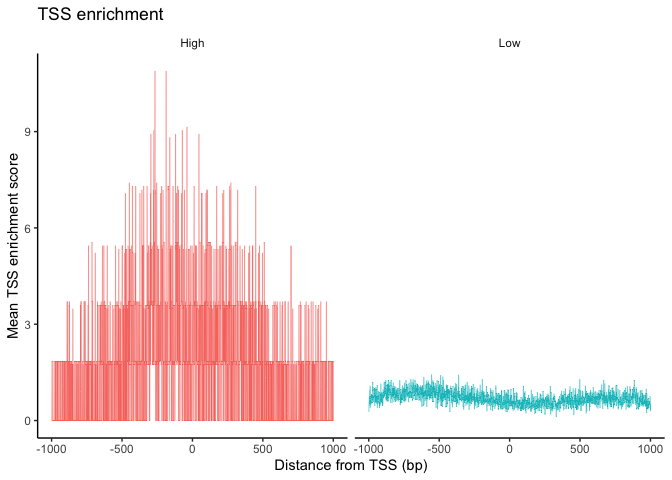

``` r
TSSPlot(pbmc) + NoLegend()
```

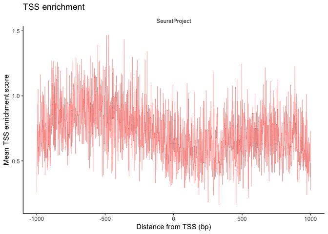

``` r
# plot the fragment periodicity
# also group the nucleosomal banding pattern
pbmc$nucleosome_group <- ifelse(pbmc$nucleosome_signal > 4, 'NS > 4', 'NS < 4')
FragmentHistogram(object = pbmc, group.by = 'nucleosome_group')
```

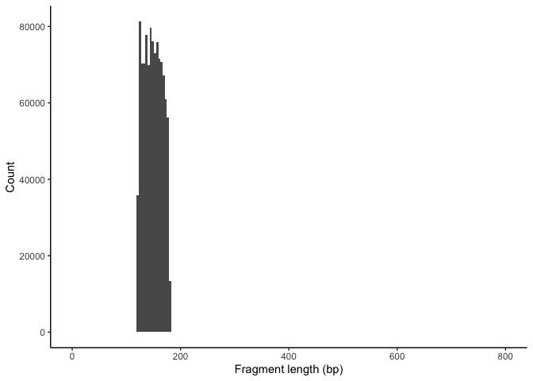

``` r
VlnPlot(
  object = pbmc,
  features = c('pct_reads_in_peaks', 'peak_region_fragments',
               'TSS.enrichment', 'blacklist_ratio', 'nucleosome_signal'),
  pt.size = 0.1,
  ncol = 5
)
```

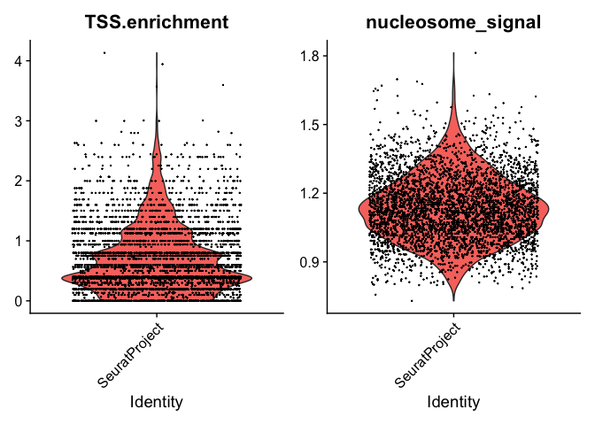

# plot coverage plots

### coverage of MS4A1, a B cell marker

``` r
DefaultAssay(pbmc) <- 'peaks'

CoveragePlot(
  object = pbmc,
  region = "chr11-60455846-60455847", # MS4A1 B cell marker chr11-60455846-60470752
  extend.upstream = 2000,
  extend.downstream = 2000, window=1
)
```

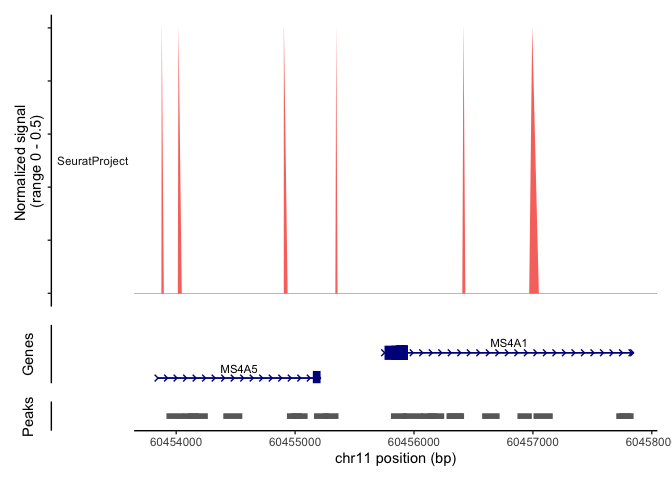

### coverage of GNLY, a NK cell marker

``` r
CoveragePlot(
  object = pbmc,
  region = "chr19-51371606-51372701", # GNLU NK cell marker
  extend.upstream = 2000,
  extend.downstream = 2000, window=1
)
```

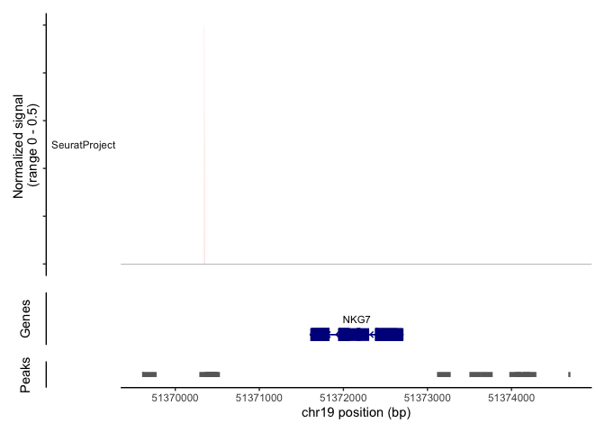

# Get the locations of all motifs

``` r
pwm <- getMatrixSet(
  x = JASPAR2020,
  opts = list(species = 9606, all_versions = FALSE)
)

all_motifs = lapply(pwm, function(x) name(x))
motif_idx = grep("GATA2|CTCF|FOXA1|EBF1", unlist(all_motifs))
pwm_select = pwm[motif_idx]
    
pbmc <- AddMotifs(pbmc, genome = BSgenome.Hsapiens.UCSC.hg38, pfm = pwm_select)
```

# Plot the footprints around specific motifs

``` r
# gather the footprinting information for sets of motifs

pbmc <- Footprint(
  object = pbmc,
  motif.name = c("GATA2"),
  genome = BSgenome.Hsapiens.UCSC.hg38,
  compute.expected = F,
  in.peaks=F,
  upstream=1000,
  downstream=1000
)

pbmc <- Footprint(
  object = pbmc,
  motif.name = c("CTCF"),
  genome = BSgenome.Hsapiens.UCSC.hg38,
  compute.expected = F,
  in.peaks=F,
  upstream=1000,
  downstream=1000
)


pbmc <- Footprint(
  object = pbmc,
  motif.name = c("FOXA1"),
  genome = BSgenome.Hsapiens.UCSC.hg38,
  compute.expected = F,
  in.peaks=F,
  upstream=1000,
  downstream=1000
) 


pbmc <- Footprint(
  object = pbmc,
  motif.name = c("EBF1"),
  genome = BSgenome.Hsapiens.UCSC.hg38,
  compute.expected = F,
  in.peaks=F,
  upstream=1000,
  downstream=1000
)

footprint_df = GetFootprintData(pbmc, features = c("CTCF", "FOXA1", "GATA2", "EBF1"))


gg_footprint_EBF1 = ggplot(subset(footprint_df, class == "Observed" & position < 500 & position > -500), aes(x=position, y=count, color = feature)) + 
                geom_line(aes(y=rollmean(count, 5, na.pad=TRUE))) +
                theme_bw() + labs(x ="Position Along TSS", y = "Normalized Count")
gg_footprint_EBF1
```

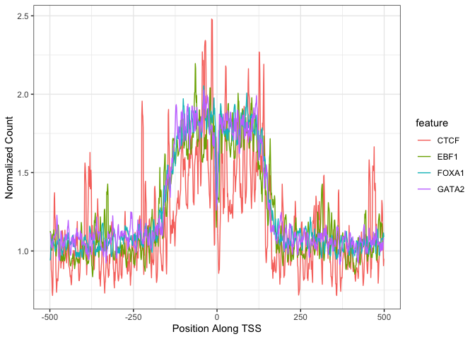

# Plot the smoothed and FFT footprints around specific motifs

``` r
# gather the footprinting information for sets of motifs

library(ggplot2)
theme_set(theme_bw())
library(signal)

# use cubic splines to distinguish between high and low 
# frequency fragmentation periodicities
get_sv_smoothed <- function(in_df, tf_id){
    
    temp_df = subset(in_df, class == "Observed" & 
                            position < 550 & 
                            position > -550 &
                            feature == tf_id)

    gen_shape = rollmean(temp_df$count, 100, na.pad=F)
    diff_df = data.frame(position=(-500):499,
                         diff_val=gen_shape)

    temp_df = subset(in_df, class == "Observed" & 
                                position < 500 & 
                                position > -500 &
                                feature == tf_id)
    #sg = sgolayfilt(temp_df$count-gen_shape, n=51)
    sg = temp_df$count-gen_shape
    
    plot_df = data.frame(position=(-500):499,
                         smoothed_count=sg,
                         tf = tf_id)

    return(plot_df)
        
}

ctcf_plot = get_sv_smoothed(footprint_df, tf_id="CTCF")
foxa1_plot = get_sv_smoothed(footprint_df, tf_id="FOXA1")
gata2_plot = get_sv_smoothed(footprint_df, tf_id="GATA2")

all_df = rbind(ctcf_plot, foxa1_plot)
all_df = rbind(all_df, gata2_plot)

# plot the smooths footprints
gg_footprint = ggplot(all_df, aes(x=position, y=smoothed_count, color=tf)) + 
                geom_line() +
                theme_bw() + labs(x ="Position Along TSS", y = "Normalized Count")
gg_footprint
```

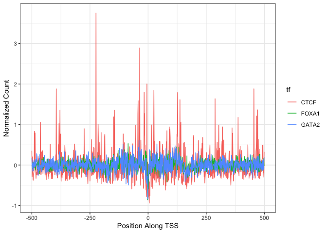

``` r
# do the FFT of the counts and plot
library(TSA)
ctcf_fft = periodogram(ctcf_plot$smoothed_count)
```

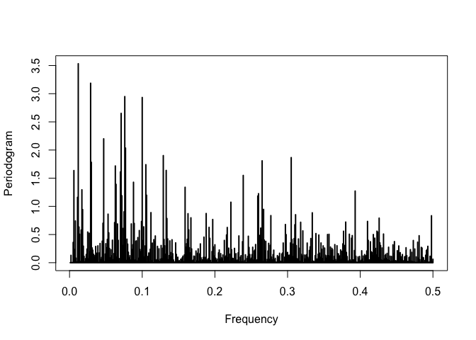

``` r
foxa1_fft = periodogram(foxa1_plot$smoothed_count)
```

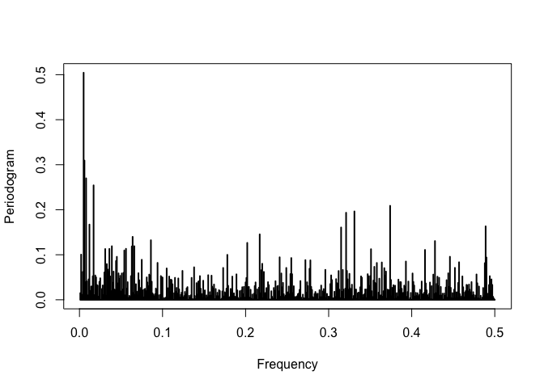

``` r
gata2_fft = periodogram(gata2_plot$smoothed_count)
```

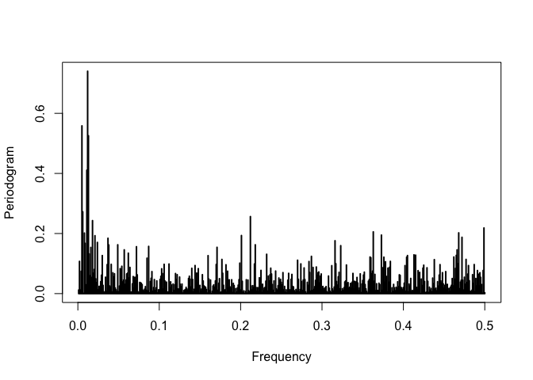

``` r
ctcf_fft_df = data.frame(freq=ctcf_fft$freq, spec=ctcf_fft$spec, tf = "ctcf")
foxa1_fft_df = data.frame(freq=foxa1_fft$freq, spec=foxa1_fft$spec, tf = "foxa1")
gata2_fft_df = data.frame(freq=gata2_fft$freq, spec=gata2_fft$spec, tf = "gata2")
plot_fft = rbind(ctcf_fft_df, foxa1_fft_df)
plot_fft = rbind(plot_fft, gata2_fft_df)
ggplot(subset(plot_fft, freq < 0.05), aes(x = tf, y = log10(spec), fill=tf)) + geom_boxplot()
```

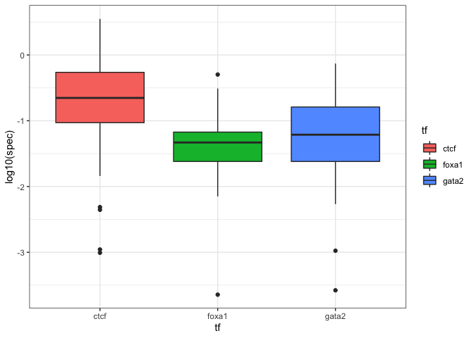

``` r
saveRDS(footprint_df, "data/data_alexis/GM_0HR_footprints.RDS")
```
